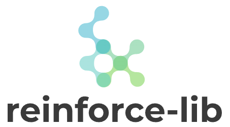

**Status**: active development (expect bugs and frequent changes to API)

<p align="center"></p>

[//]: # ()

# Reinforce-lib

---
Reinforce-lib is a Deep Reinforcement Learning library built on top of [TensorFlow 2](https://www.tensorflow.org/), 
[tensorflow-probability](https://www.tensorflow.org/probability), [NumPy](https://numpy.org/), and 
[Gym](https://github.com/openai/gym). It's modular and designed to be simple to use, understand, and extend.

Installation:
```bash
# clone the repository first
git clone https://github.com/Luca96/reinforce-lib.git

# enter in the directory
cd reinforce-lib

# install requirements:
# NOTE: using a virtualenv is highly suggested, so you should create it before installing the dependencies
pip install -r requirements.txt
```

## Agents

For now, only a variety of *model-free* algorithms are implemented, but it's planned to also add some *model-based* and 
*inverse RL* algorithms. Implemented agents:
- [DQN](https://www.nature.com/articles/nature14236?wm=book_wap_0005) and extensions: 
[PER](https://arxiv.org/pdf/1511.05952), [Double Q-Learning](https://ojs.aaai.org/index.php/AAAI/article/download/10295/10154), 
[Dueling architecture](http://proceedings.mlr.press/v48/wangf16.pdf); supports also 
[noisy networks](https://arxiv.org/pdf/1706.10295.pdf) for exploration.
- VPG (aka [REINFORCE](https://link.springer.com/content/pdf/10.1007/BF00992696.pdf))
- A2C (synchronous version of [A3C](http://proceedings.mlr.press/v48/mniha16.pdf))
- [PPO](https://arxiv.org/pdf/1707.06347.pdf?ref=https://githubhelp.com) (clipped objective) with 
[GAE](https://arxiv.org/pdf/1506.02438.pdf?ref=https://githubhelp.com)
- [DDPG](https://arxiv.org/pdf/1509.02971.pdf)
- [TD3](http://proceedings.mlr.press/v80/fujimoto18a/fujimoto18a.pdf)
- [SAC](https://arxiv.org/pdf/1812.05905): supports automatic tuning of temperature.
- [Rainbow](https://www.aaai.org/ocs/index.php/AAAI/AAAI18/paper/viewFile/17204/16680)
- [IQN](http://proceedings.mlr.press/v80/dabney18a/dabney18a.pdf)

## Features

- Support for **custom environments**, based on `gym.Env`.
- Support for **custom networks** (value, policy) through subclassing.
- Support for **custom agents** through subclassing.
- Support for **dict observation space**.
- Support for **dict action space**, in `VPG`, `A2C`, and `PPO`.
- Async **Tensorboard summaries**!

## Model Zoo
Pre-trained agents will be available at the [reinforcelib-zoo](https://github.com/Luca96/reinforcelib-zoo) repo.

## Examples
Define a DQN agent on CartPole:
```python
from rl import utils
from rl.agents import DQN
from rl.presets import Preset
from rl.parameters import StepDecay
from rl.layers.preprocessing import MinMaxScaling


# Fix random seed
utils.set_random_seed(42)

# Preprocess states by min-max scaling, scaling then in [-1, 1]
scaler = MinMaxScaling(min_value=Preset.CARTPOLE_MIN, 
                       max_value=Preset.CARTPOLE_MAX)

# Create the DQN agent on CartPole
agent = DQN(env='CartPole-v1', name='dqn-cartpole', batch_size=128,
            policy='e-greedy', lr=1e-3, update_target_network=500,
            # halve epsilon each 100 episodes
            epsilon=StepDecay(0.2, steps=100, rate=0.5), gamma=0.99,
            memory_size=50_000, seed=utils.GLOBAL_SEED,
            # set to `False` to disable tensorboard summaries; saved by default in `logs/dqn-cartpole`
            use_summary=True,
            # create two-layer 64 units with ReLU + min-max scaler on states
            network=dict(units=64, preprocess=dict(state=scaler)))
```

Train the agent:
```python
# Train the agent for 200 episodes, each of maximum length of 500
# - when `save=True`: the "best" agent is saved at each evaluation; so also `evaluation` has to be provided.
# - `evaluation=dict(...)`: averages the agent performance on 20 episodes; evaluation is done each `freq` learning episodes.
# - `exploration_steps=N`: the first N timesteps are exploratory, meaning that the agent will act randomly. 
agent.learn(episodes=200, timesteps=500, save=True, render=False,
            evaluation=dict(episodes=20, freq=10), exploration_steps=512)
```

Load a saved agent:
```python
# After training, you can load the saved agent: for now, you have to still defined the agent as above.
# - By default, if you train an agent (with same name), each run is assigned a "timestamp".
# - Moreover, each episode is paired with the achieved total reward.
# - So, the default saving pattern is: weights/<agent-name>/<timestamp>/<episode>-<reward>
# - The `load()` function can load a specific folder, or the best agent across runs (by default).
agent.load(path='your-path/weights/dqn-cartpole')
```

Record (video) interactions of the agent with the environment:
```python
# By default, recordings are saved to: "<folder>/<agent-name>/<timestamp>"
# - `rename=True`, the path is changed to: "<folder>/<agent-name>/<timestamp>-<reward>"
for _ in range(num):
    agent.record(timesteps=500, folder='video')
```

Print a summary of the agent's network(s), and the structure of its memory buffer:
```python
agent.summary()
agent.memory.summary()
```

Monitor summaries with tensorboard (default port is `6006`, change with `--port <number>`):
```bash
tensorboard --logdir <your-path>/logs/<agent-name>
```

---

## How to Cite
If you use this library for your own projects and research, please cite it.
A proper citation will be provided soon. For now just mention the repository.
